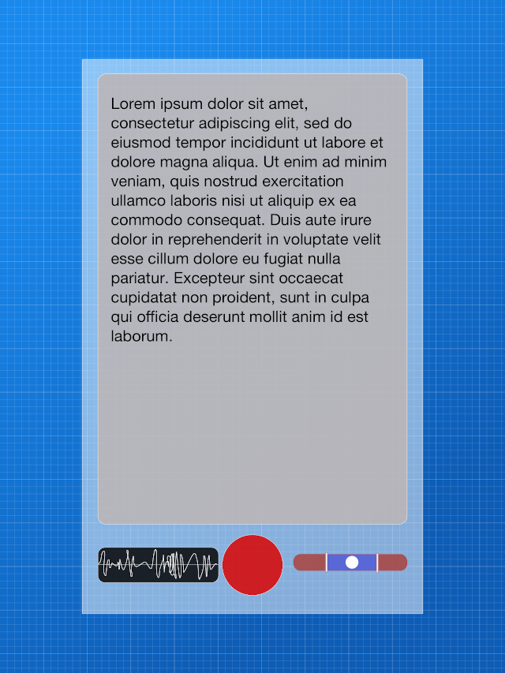

# Speaker app

The application is initial step towards Accent detector

## Road map

1. Read & Write audio simultaneously from/to mic and speaker
    - [x] Support earpiece
    - [x] Support USB headphones
    - [x] Support BT headphones
    - [x] Achieve minimal latency
    
2. Embed tongue twisters
	- [x] UI for selecting twisters
	- [ ] UI font and background selection (Themes)
	
3. Draw FFT in real time
   - [ ] Calculate FFT without affecting audio transmitter (multithreading)
   - [ ] Display FFT based spectrogram in real time
   - [ ] Achieve minimal latency

4. Set timbre preferences
   - [ ] Calculate timbre of the speaker
   - [ ] Display timbre scale
   - [ ] Introduce the ability to set timbre range
   - [ ] Vibrate/sound when the speaker gets out of the range
    
5. Speech to text
   - [ ] Use embedded tools for speech recognition
   - [ ] Try word to word processing with confidence level
   - [ ] Colorize text based on confidence level

    
## Mockup
